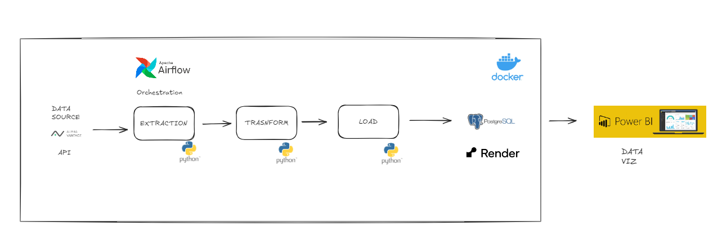

##  IBM Financial ETL Pipeline

A complete data engineering project that extracts, transforms, and loads IBM stock market and financial data using Python. It integrates with a PostgreSQL database and supports dbt for transformation and Power BI for visualization.

---

###  Project Overview

This project automates the ETL pipeline for IBM stock data and company financials using the [Alpha Vantage API](https://www.alphavantage.co/). It stores the processed data in a PostgreSQL database and prepares it for analysis and modeling with [dbt](https://www.getdbt.com/).

---

### Project Structure

```
projeto_etl_ibm/
│
├── data/                    # Raw and processed CSVs
│   └── processed/
├── dbt_ibm/                 # dbt project folder
├── src/                     # Python scripts
│   ├── data_extraction.py
│   ├── data_transformation.py
│   └── data_load.py
├── requirements.txt         # Python dependencies
├── Dockerfile               # Containerized ETL pipeline
└── README.md
```

---

### Technologies Used

- **Python 3.12**
- **Pandas** for data manipulation
- **SQLAlchemy** for database operations
- **PostgreSQL** (hosted on [Render](https://render.com/))
- **Docker** for containerization
- **dbt** for transformations and models
- **Power BI** for data visualization
- **Apache Airflow** (via Astronomer CLI)

---

###  How it works

1. **Extract**: Collects daily stock prices and company overview for IBM using Alpha Vantage API.
2. **Transform**: Creates star schema tables (`dim_empresa`, `dim_indicador`, `dim_tempo`, `fact_cotacoes`, `fact_indicadores`).
3. **Load**: Inserts the transformed data into a PostgreSQL database.
4. **Model** (optional): dbt can be used to create additional models (e.g., average monthly price).
5. **Visualize** (optional): Dashboards can be created in Power BI.

---

###  Run with Docker

```bash
# Build the Docker image
docker build -t etl_ibm .

# Run the ETL pipeline
docker run --rm etl_ibm
```

Make sure to configure your `.env` file with your database and API credentials.